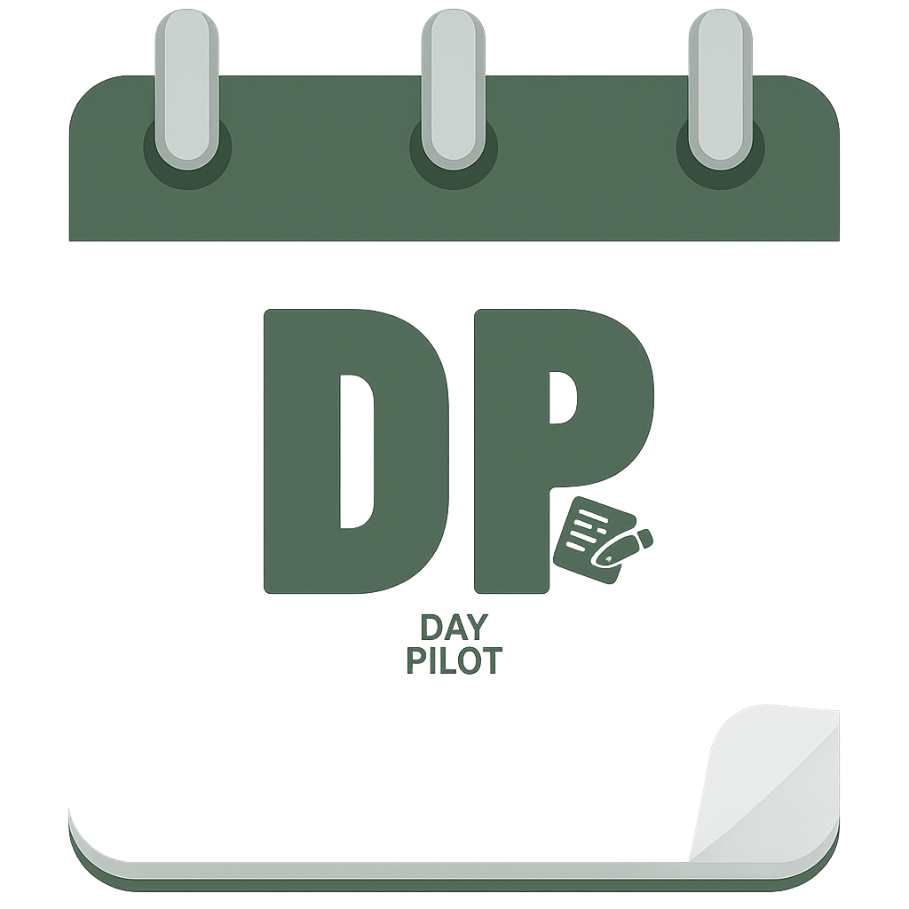

<h1>
  
  DayPilotAI
  
</h1>

## Introduction:

DayPilot is an all in one application aimed at maximizing personal productivity combining scheduling, reminders, sticky notes, and analytics all in one unified yet minimalistic interface. While other applications require the user to bounce between the different tools app to app, DayPilot has everything you’ll need to generate more workflow all in one place. Whether you are struggling to create structure in your day and end up doing nothing, or just have too many tasks to manage, DayPilot will help you. 

The goal of this project is to solve the chaos caused by productivity tools being unmanageable and slower due to separation. DayPilot offers users a hassle free experience by combining multiple managing tools into one place for their discretion. Scheduling, note-taking, reminders, & analytics all combined into one user-friendly interface. The goal is to simplify everyday organization and reduce the inconvenience of bouncing between multiple applications.

## Features:

### Minimum Viable Product (A Features)
The user will be able to assign tasks to hours during the day.  
Notes can be added for each task.  
The user will be receiving notifications for tasks ending or starting.  
Users will signup and login to the application.  
User has a clickable calendar view to see tasks assigned.  
Users will see tasks assigned hourly.  
Ability for user to set tasks to be repeated X days.  

### Alpha (B Features).
Ability for user to change their calendar view to be a weekly view for simplicity.  
User can input a picture inside the tasks notes instead of text.  
Users can record voice memos inside notes instead of text.  
The theme can be changed for the user depending if they want light mode or dark mode.  
The user can switch between English or Spanish translations.  
User can speak to AI agent telling it to create a task on specific day/time.  

### Beta  (C Feature)
User can see analytics on tasks completion stats.  
They see a live timer of task until it is set to be done  
Users can choose to receive recently completed tasks in email.  
Ability for a user to get personalized scheduling based on deep learning.  
The user can handwrite notes instead of keyboard input.  

## Technologies:

Android SDK: (Min 24) (Target 34)  
Programming Language: Kotlin  
Database: Firebase  
Authentication: FirebaseAuth  
Built in Android notifications  
Built in Calendar  
Our own API to call upon (learn how to call below)  

## Installation:

Version 1.0 not released yet - No download available.

## Development-Setup:

#Prerequisites 
- Android Studio
- Java Development Kit - Required by Android Studio and Gradle for kotlin builds
- Git
- An Android device or emulator API 34 or higher
- Clone the Repository
- Open the projetc in Android Studio
    1. Open Android Studio
    2. Cliick "Open an Excisting Project" and select cloned directory
    3. let Android Studio finishing indexing and syncing Gradle
- Configure Firebase
   Firebase is already integrated into the project (Auth + Firestore).  
No additional setup is required unless you're creating a new Firebase project.
- Run the App
- Tech Stach Summary
  1. Language: Kotlin
  2. Min SDK: 24
  3. Target SDK: 35
  4. Libraries used (so far)
     - Firebase Authentication & Firestore
     - Kizitonwose/Calendar(for calendar UI)
     

## License:

©[Michael DiBella, Ryan Reese, Luis Orellana, Abubakar Mohammed] [2025]. This project is under development. License will be determined later on.

## Contributors:

Michael DiBella  
Ryan Reese  
Luis Orellana  
Abubakar Mohammed  

## Project-Status:

Pre-Alpha

## API-References:

## Roadmap:

Phase 1: Core Functionality 

- User Authentication(signup/login via Firebase)
- Clickable calendar view using Kizitonwose/Calendar
- Assign tasks to specific hours during the day
- View daily schedule with hourly task breakdown
- Add notes to individual tasks
- Set tasks to repeat every X days
- Task start and end notifications using AlarmManager
- Store data using Firestore

Phase 2: Add flexibility, personalization and media enhacements

- Switch between daily and weekly calendar view 
- Add images inside task notes 
- Add voice memos inside task notes 
- ight mode/Dark mode theming 
- Language toggle: English -Spanish 
- Voice assistant integration (AI agent that creates tasks via voice commands)

Phase 3:Advanced personalizations

- Task completition analytics dashboard(completed vs missed)
- Live task countdown timer 
- Email Summaries 
- AI-generated schedules based on user behavior/preferences (deep learning
- Handwritten notes support 
- Improved animations and transitions
- Prepare and optimize release build
- Write complete documentation (README, code comments, API docs)

